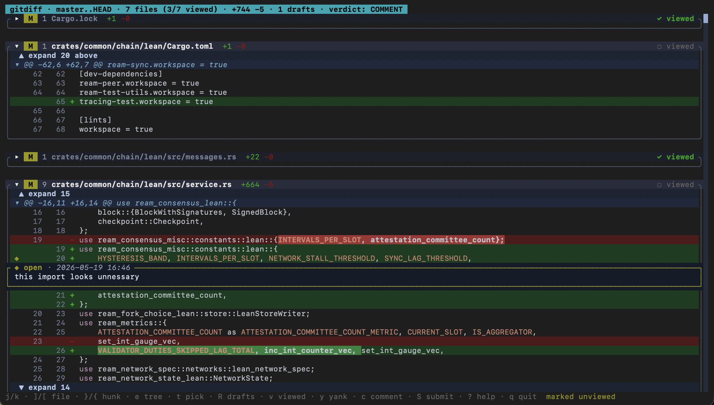

# gitdiff

A Rust + ratatui TUI for reviewing local git changes like a GitHub PR — without
pushing or opening a PR. Comments are written to a `REVIEW.md` at the repo root,
in a format a coding agent (or another human) can act on directly.



## Install

```sh
cargo install --path .
```

## Use

From any git repo:

```sh
gitdiff                  # auto-detects: working changes, else branch vs upstream
gitdiff base..head       # explicit range
```

### Keys

`j`/`k` line · `]`/`[` file · `}`/`{` hunk · `e` tree · `t` pick · `R` drafts ·
`v` viewed · `y` yank · `c` comment · `S` submit · `?` help · `q` / `ctrl-c` quit

Click a line to comment, click an existing comment to edit it.

See `PLAN.md` for design notes and the milestone roadmap.
